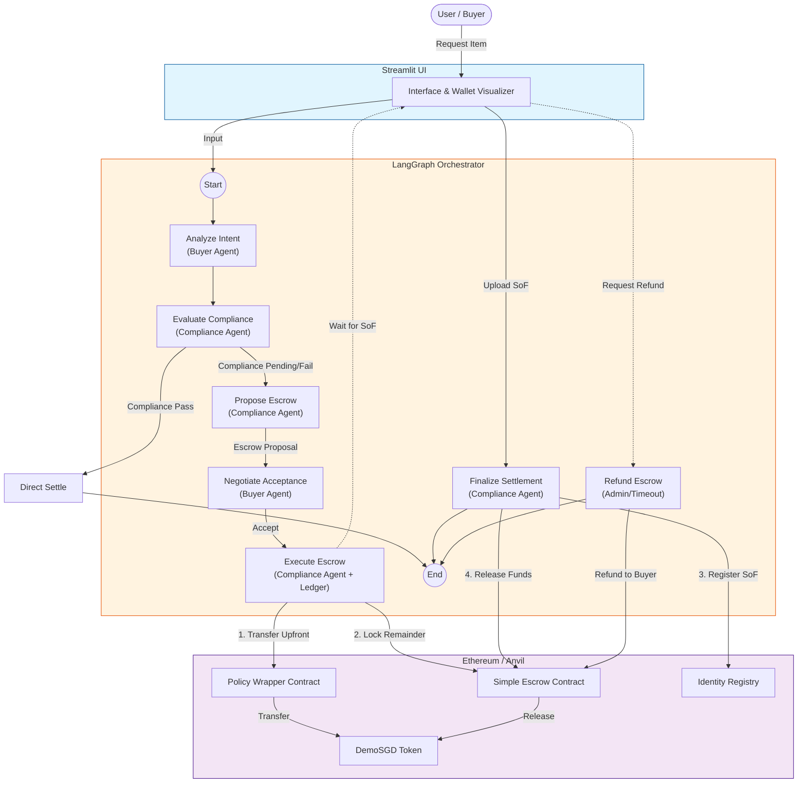

# Agentic Compliance Payment System - Technical Documentation

## 1. System Overview

The **Agentic Compliance Payment System** is a demonstration of an autonomous multi-agent workflow that handles cross-border payments with embedded compliance checks. It utilizes **Large Language Models (LLMs)** to reason about compliance rules and **Ethereum Blockchain** smart contracts to enforce settlement and escrow logic.

The system features two primary agents:
*   **Buyer Agent**: Represents the user, interprets intent, and handles negotiations.
*   **Compliance Agent**: Enforces regulatory policies (Sanctions, Source of Funds) and orchestrates on-chain transactions.

## 2. Architecture

The system is built using a modular architecture where a central orchestrator manages the state and flow between agents.

### High-Level Architecture Diagram

## 3. Core Components

### 3.1. Frontend (Streamlit)
*   **File**: `app.py`
*   **Role**: Provides the user interface for inputting requests, visualizing the agent thought processes ("Thinking..."), and monitoring the mock wallet balances.
*   **Features**:
    *   **Real-time Graph Visualization**: Renders the active step of the agent workflow.
    *   **Live Ledger**: Shows balances for Buyer, Seller, and Escrow.
    *   **Interaction**: Allows users to upload "Source of Funds" documents to trigger state updates.

### 3.2. Orchestrator (LangGraph)
*   **File**: `src/graph.py`
*   **Role**: Manages the state machine of the application. It defines the nodes (agent actions) and edges (transitions) based on the compliance status.
*   **State**: `GraphState` (defined in `src/state.py`) maintains the shared context, including:
    *   `messages`: Chat history.
    *   `buyer_intent`: Parsed purchase details (Item, Amount).
    *   `compliance_status`: Current state (PASS, PENDING, FAIL).
    *   `ledger`: Off-chain representation of wallet balances.

### 3.3. Agents

#### **Buyer Agent**
*   **File**: `src/agents/buyer.py`
*   **Responsibilities**:
    *   `analyze_intent`: Uses LLM to extract the item and price from the user's natural language request.
    *   `negotiate_acceptance`: Acts on behalf of the user to accept the Compliance Agent's proposal (e.g., agreeing to an escrow arrangement).

#### **Seller Agent (Placeholder)**
*   **Current Role**: In this demo, the Seller Agent is implicitly represented by the system's acceptance of the transaction once compliance is met. It does not have an active negotiation node.
*   **Future/Real-World Scope**: In a production environment, the Seller Agent would be an autonomous actor responsible for:
    *   **Inventory Management**: Checking real-time stock availability before accepting an order.
    *   **Price Negotiation**: Counter-offering if the Buyer's bid is too low.
    *   **KYC/KYB**: Performing "Know Your Business" checks on the Buyer.
    *   **Logistics**: Triggering shipping workflows upon escrow confirmation.

#### **Compliance Agent**
*   **File**: `src/agents/compliance.py`
*   **Responsibilities**:
    *   `evaluate_compliance`: Checks if the transaction amount exceeds the threshold ($1000) and if Source of Funds (SoF) is verified. Queries the blockchain `IdentityRegistry`.
    *   `propose_escrow`: If compliance checks fail (e.g., high amount, no SoF), proposes a risk-mitigation strategy (e.g., 20% upfront, 80% escrow).
    *   `execute_escrow`: Interact with the blockchain to transfer the upfront payment and lock the remainder in the `SimpleEscrow` contract.
    *   `finalize_settlement`: Once SoF is provided, updates the on-chain registry and triggers the release of funds from the escrow.

### 3.4. Blockchain Layer (Smart Contracts)
*   **Location**: `solidity/`
*   **Contracts**:
    *   **PolicyWrapper**: Acts as a middleware to enforce policy checks before allowing token transfers.
    *   **SimpleEscrow**: Holds funds securely until released by an authorized agent (Compliance Agent).
    *   **IdentityRegistry**: Stores the verification status of users (Sanctions check, Source of Funds).
    *   **DemoSGD**: An ERC-20 token used for payments.

## 4. Workflow (Happy Path)

1.  **User Request**: User wants to buy a "Luxury Watch" for $1500.
2.  **Analysis**: Buyer Agent parses the request.
3.  **Evaluation**: Compliance Agent sees $1500 > $1000 threshold and no existing SoF. Status -> `PENDING`.
4.  **Proposal**: Compliance Agent proposes a 20/80 split (20% direct, 80% escrow).
5.  **Agreement**: Buyer Agent accepts the proposal.
6.  **Execution**:
    *   Compliance Agent triggers a transaction to move 20% to the Seller via `PolicyWrapper`.
    *   Compliance Agent moves 80% to the `SimpleEscrow` contract.
    *   System pauses and requests Source of Funds.
7.  **Verification**: User uploads `mock_sof.txt`. System verifies content.
8.  **Finalization**:
    *   Compliance Agent records the SoF hash on `IdentityRegistry`.
    *   Compliance Agent calls `release()` on `SimpleEscrow`.
    *   Seller receives full payment. Transaction Complete.

## 5. Workflow (Alternate Path: Escrow Refund)

If the user decides not to proceed with the transaction or fails to provide the required Source of Funds (SoF) within a reasonable timeframe, the escrow can be refunded.

1.  **Escrow Active**: The system is in `ESCROW_ACTIVE` state, waiting for user input.
2.  **Refund Trigger**: The user (or an admin/timeout mechanism) triggers the "Refund Escrow" action via the UI.
3.  **Process**:
    *   The `Refund` node (or Admin function) calls the `refund()` function on the `SimpleEscrow` contract.
4.  **Completion**:
    *   The funds locked in the escrow contract are returned to the Buyer.
    *   The transaction is marked as cancelled/refunded.
